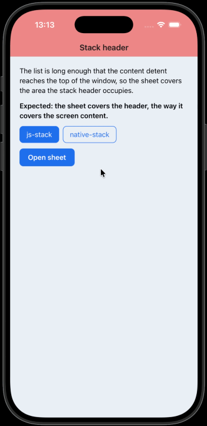

# `@react-navigation/stack` header renders above the bottom sheet

Open an inline `BottomSheet` tall enough to reach its full height and the
`@react-navigation/stack` header still draws on top of it. Point the same screen at
`@react-navigation/native-stack` and the sheet covers the header.



`BottomSheet` sits next to `NavigationContainer`, a level above the screens. The content
is a `FlatList` of 30 items on the default detents (`[0, 'content']`).

## Versions

|                                        |         |
| -------------------------------------- | ------- |
| `@swmansion/react-native-bottom-sheet` | 0.16.2  |
| `@react-navigation/stack`              | 7.10.22 |
| `@react-navigation/native-stack`       | 7.18.9  |
| `@react-navigation/native`             | 7.3.16  |
| `expo`                                 | 57.0.15 |
| `react-native`                         | 0.86.2  |
| `react`                                | 19.2.3  |

iOS only.

## Run

The sheet is a native module, so you need a development build. The `ios` folder is
checked in. For Android, run `npx expo prebuild --platform android` first.

```sh
npm install
npm run ios
```

## Steps

1. Launch the app with **js-stack** selected.
2. Tap **Open sheet**.
3. Look at the top edge of the sheet where it meets the navigation header.
4. Close the sheet, tap **native-stack**, and open the sheet again.

## Expected

The sheet covers the header the same way it covers the rest of the screen.

## Actual

| Host           | Header while the sheet is open |
| -------------- | ------------------------------ |
| `js-stack`     | draws over the sheet           |
| `native-stack` | covered by the sheet           |
